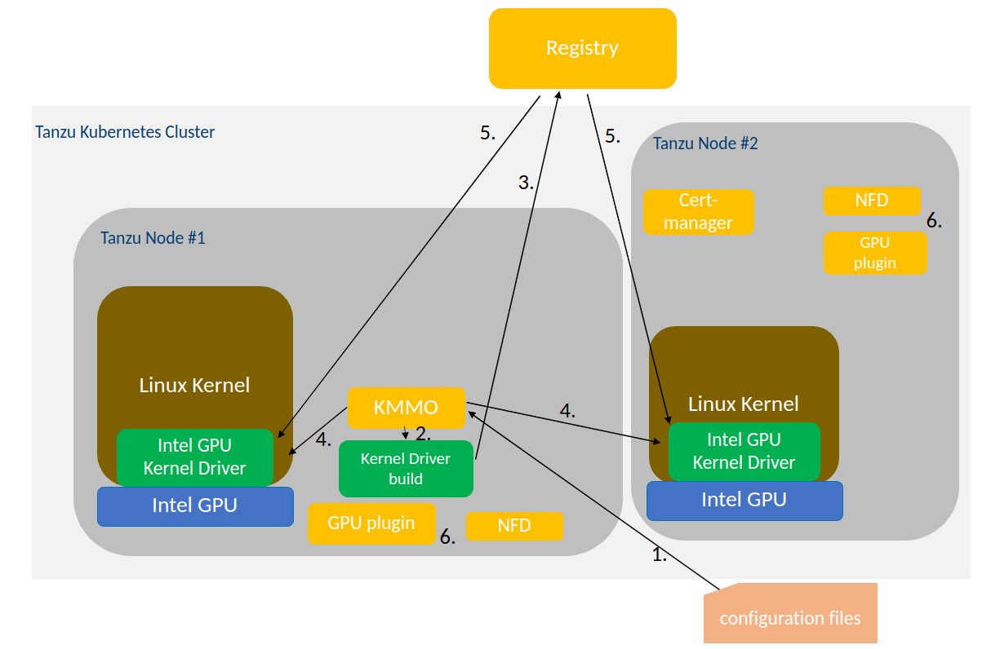

# Intel® Data Center GPU Utilities for VMWare Tanzu*

Intel® Data Center GPU Utilities for VMWare Tanzu* enables installing of Intel® GPU drivers to vanilla Ubuntu Kubernetes nodes. It downloads, builds and loads the kernel driver and corresponding firmware to the node. When the deployment is removed, all the traces of the driver are removed. With the installed GPU driver, node's Intel® GPUs can be utilized to run compute and other GPU accelerated workloads.

CAUTION: This is an alpha / non-production software, do not use on production clusters.

Table of Contents

* [Structure](#structure)
* [Install](#install)
    * [Cluster versions](#cluster-versions)
    * [Container image registry](#container-image-registry)
    * [Deployment](#deployment)
    * [Disabling dependencies](#disabling-dependencies)
    * [Debugging issues](#debugging-issues)
* [Uninstall](#uninstall)
* [Limitations](#limitations)
    * [Firmware load path](#firmware-load-path)
    * [Kernel versions](#kernel-versions)
* [Links](#links)

## Structure

</img>

1. Kernel Module Management Operator (KMMO) is instructed by the *configuration files* to build and deploy *Intel GPU Kernel Driver* container image to the nodes that have Intel GPU HW and suitable Linux kernel.
1. KMMO deploys a Pod to build the GPU kernel driver on one of the GPU enabled nodes.
1. Built GPU kernel driver container image is pushed to an external container image registry.
1. KMMO deploys Pods via a Daemonset on nodes that have Intel GPU device. The Pod copies FW files and loads the kernel driver into the host kernel.
1. Container image including the GPU driver and FW is pulled from the external registry.
1. Once the kernel driver is available, Intel GPU plugin starts and registers the GPU resources to the cluster.

## Install

### Cluster versions

The deployment supports a range of Kubernetes cluster versions:

* 1.25 - 1.29

The range comes via the dependency images and their supporter versions:

* Cert-Manager: 1.24 - 1.29
* Node Feature Discovery: 1.21 ->
* Intel Device Plugins: 1.25 - 1.29

While not officially supported or tested, deployment may work fine also on older Kubernetes clusters. The deployment uses basic Kubernetes functionality and its dependencies should not depend on latest Kubernetes features either.

### Container image registry

The installation requires a container image registry to be accessible and writable. The registry is used to push and pull the GPU driver container image. The image's URL and the possible authentication details need to be provided to the helm install command, or changed in the *values.yaml* file.

### Deployment

The driver is installed with one helm chart. This requires helm to be [installed](https://helm.sh/docs/intro/install/).

Install depends on a few variables:

* local.image - <u>Required</u>
  * A template URL that will be used to store the GPU driver container image.
  * e.g. my.registry.acme.com/intel-gpu-driver
  * Resulting container image will have a kernel specific tag: *I915-23W01.5-5.15.0-79-generic*
* local.secret.base64 - Recommended
  * Secret for accessing the registry, if registry requires authentication.
  * Docker's `config.json` in base64 format.
* build.baseImage - Optional
  * If cluster is behind a proxy, set this to an URL that is accessible inside the network.
  * e.g. 192.168.0.100/ubuntu:20.04
* proxy - Optional
  * http, https, no_proxy
  * Used if inside a proxy enabled network. Required to fetch driver code from Github projects during build.

To install the chart:

```
helm dep update
# values.yaml is updated with gpu driver image URL and credentials
helm install --create-namespace -n inteldeviceplugins intel-gpu .
```

Registry image URL and credentials can also be given in the helm's install arguments:

```
helm dep update
helm install --create-namespace -n inteldeviceplugins --set local.image=my.registry.acme.com/intel-gpu-driver --set local.secret.base64=A123424...438483843= intel-gpu .
```

> NOTE: See [Firmware load path](#firmware-load-path) for firmware load configuration.

Once install has succeeded, the Pod listing should look like this:
```
$ kubectl get pods -n cert-manager
NAME                                                 READY   STATUS    RESTARTS   AGE
intel-gpu-cert-manager-7cc59588d6-glvsf              1/1     Running   0          2m7s
intel-gpu-cert-manager-cainjector-8449dfb7db-72fxp   1/1     Running   0          2m7s
intel-gpu-cert-manager-webhook-85f9d8b544-bf2br      1/1     Running   0          2m7s

$ kubectl get pods -n kmm-operator-system
NAME                                              READY   STATUS    RESTARTS   AGE
kmm-operator-controller-77f78f96c6-psrql          2/2     Running   0          34s
kmm-i915-backport-build-dhpcl                     1/1     Running   0          28s

$ kubectl get pods -n node-feature-discovery
NAME                                   READY   STATUS    RESTARTS        AGE
intel-gpu-nfd-master-f5b8c6c4d-kcmfl   1/1     Running   0               2m29s
intel-gpu-nfd-worker-95nsk             1/1     Running   1 (2m12s ago)   2m29s
intel-gpu-nfd-worker-97d8t             1/1     Running   1 (2m11s ago)   2m30s
```

Once the kmm-i915-backport-build-dhpcl Pod has completed, another Pod will appear shortly and then disappear:

```
$ kubectl get pods -n kmm-operator-system
NAME                                              READY   STATUS    RESTARTS   AGE
kmm-operator-controller-77f78f96c6-psrql          2/2     Running   0          2m2s
kmm-worker-gpunode01-kmm-i915-backport            1/1     Running   0          15s
kmm-worker-gpunode02-kmm-i915-backport            1/1     Running   0          14s
```

After the GPU driver is loaded to the node, the Intel GPU plugin will get deployed on the node:

```
$ kubectl get pods -n inteldeviceplugins
NAME                                                     READY   STATUS    RESTARTS   AGE
intel-gpu-plugin-gpudeviceplugin-sample-f6d6d            1/1     Running   0          2m7s
intel-gpu-plugin-gpudeviceplugin-sample-t6hxn            1/1     Running   0          2m7s
inteldeviceplugins-controller-manager-86b94df46c-4wtf6   2/2     Running   0          2m14s
```

When the `gpu.intel.com/i915` resource is registered to nodes, workloads requesting the resource will be scheduled on the nodes.

### Disabling dependencies

The chart includes a couple of dependencies that are installed: cert-manager, node-feature-discovery, Intel device plugin operator and GPU device plugin.

In case the target cluster has some of the dependencies already installed. those can be disabled in the *values.yaml* file, or by setting suitable variables in the install phase.

```
# disable cert-manager
helm install --create-namespace -n inteldeviceplugins --set deps.certmanager=false intel-gpu .

# disable nfd
helm install --create-namespace -n inteldeviceplugins --set deps.nfd=false intel-gpu .
```

### Debugging issues

First check that the issue is not due to known [limitations](#limitations).

#### Network policies

The deployment limits in-cluster access to some of the namespaces. If the deployment fails and the symptoms seem like connectivity issues, one can try to disable the network policies in the `values.yaml` by:

```
networkpolicy:
  enabled: false
```

#### Connectivity

In corporate environments proxies are a common thing. One should set the *proxies* and *no_proxies* in the values.yaml.

```
proxy:
  http: proxy.acme.com:8080
  https: proxy.acme.com:8081
  no_proxy: acme.com,localhost,192.168.0.0/24
```

#### Build breakage

Sometimes the kernel driver build can fail. Check the build issues from the Pod's logs:

```
kubectl logs -f -n kmm-operator-system kmm-i915-backport-build-dhpcl
```

## Uninstall

Helm:

```
kubectl delete modules.kmm.sigs.x-k8s.io -n kmm-operator-system kmm-i915-backport
helm uninstall -n inteldeviceplugins intel-gpu
```

> *NOTE:* kubectl command above is crucial to properly uninstall the GPU KMD. Otherwise driver will stay loaded and there will be CRD conflicts.

As Helm does not support deleting or updating CRDs, they have to be deleted manually. Cleanup script will also try to remove old namespaces.

```
bash scripts/cleanup.sh
```

*NOTE*: `cleanup.sh` will remove everything. Modify it to ignore dependencies that you might have installed separately.

## Limitations

### Firmware load path

When KMMO launches the GPU driver Pod on GPU HW nodes, it copies the firmware files under `/var/lib/firmware`. This path is not in the default search paths for kernel firmware. If possible, it is best to add `firmware_class.path=/var/lib/firmware` to the kernel command line.

With KMMO 2.0 it is now possible to modify the firmware load path automatically by adding a config option. This feature is disabled by default in the configuration, but can be enabled by setting `setFirmwareClassPath: true` in the values.
Setting the firmware load path via KMMO only works with CRI-O. Containerd has a [bug](https://github.com/containerd/containerd/issues/8445) with privileged containers where `sysfs` is mounted as `ro` when it should be `rw`.

For containerd, there is a workaround that can be enabled by setting `firmwareLoadPathHack: true` in values. This will create a daemonset for all the Intel GPU nodes which writes `/var/lib/firmware` to `/sys/module/firmware_class/parameters/path` in order for the firmware to be loaded correctly.

### Kernel versions

I915 backport driver supports only a handful of kernel versions. For example Ubuntu 20.04 was released with 5.4 kernel and the supported backport kernel is 5.15. The kernel might need to be updated for the backport driver to compile. The supported OS & kernel versions are [listed](https://github.com/intel-gpu/intel-gpu-i915-backports#supported-os-distributions) in the backports project.

## Links

* [Intel GPU plugin](https://github.com/intel/intel-device-plugins-for-kubernetes/blob/main/cmd/gpu_plugin/README.md)
* [Intel Device plugin operator](https://github.com/intel/intel-device-plugins-for-kubernetes/blob/main/cmd/operator/README.md)
* [Kernel Module Management Operator](https://github.com/kubernetes-sigs/kernel-module-management/)
* [Node Feature Discovery](https://github.com/kubernetes-sigs/node-feature-discovery/)

## License

Project uses Apache 2.0.

Some of the components installed during deployment do use different licenses.
